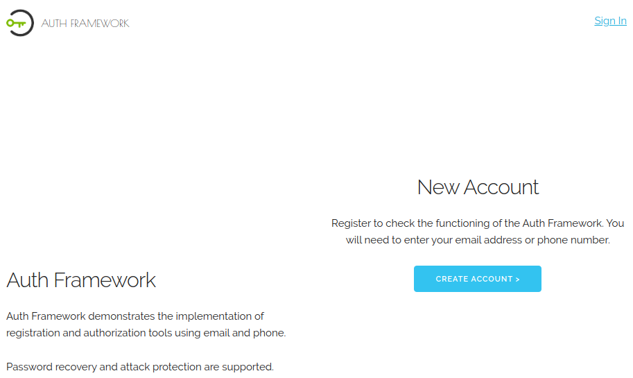

# Auth Framework
Authorization framework development project. Provides the following features:
- Registration via e-mail
- Phone number confirmation
- Authorization via e-mail or phone number
- Protection from attacks
---
 <!-- .element height="100%" width="100%" -->
---
You can check how it works by following the link <https://auf.herokuapp.com/>
